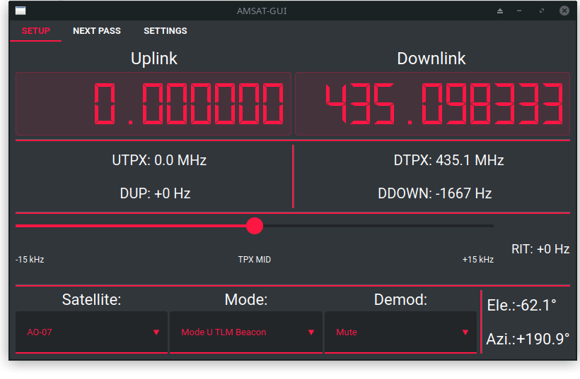

# PARST
Portable AmateurRadio Satelite Tracker

## Introduction
This is a WIP proof-of-concept test for a portable amateur satellite full-duplex system. A rtl-sdr is used for RX and an hamlib compatible Rig for TX (FT-818 in this case). The TLEs are parsed and matched against a list of desired satellites. The satnogs transmitter database is used as frequency lookup.
Two external rotary encoders might be used on a RPi to control the VFO and RIT of the system

Notice: this project is Work-in-Progress. It has a lot of bugs and most probablly won't run out of the box. I'm working on it, but feel free to take part in the development!

## Setup
There are some steps for the software to run:
1. Install python dependencies (have a look at the imported modules)
2. Install [rtl-udp](https://github.com/sysrun/rtl-sdr) to manage live tuning of sdr dongle as well was rtl-tcp (depending on choosen demod chain)
3. Intsall csdr

## Technical Information
For demod there are tow demodulation chains availabe. The first one uses rtl_tcp and csdr to demodulate. nmux is used to redistribute the IQ data which enables the implementation of a FFT view down the road. I've run into performance issues on a Rpi 2 using that signal chain.

The second option is a rtl_udp and csdr with direct data piping which is better for leightweight systems but does not feature the option to add a FFT view later on.

## ToDo
A lot, I'm serious !

- Various error handlers. Basic error handling is implemented but there is a lot room for improvement
- UI rework: dynamic scalling
- Better modulization: Allow quicker config for other hardware configs like two radios with CAT
- Automatic TLE and transmitter list download and parsing
- Demodulation box not implemented for leightweight demodulation chain
- More comments, code rework
- external configuration filefor easier deployment for new users

## Credits
- satnogs for transmmitter database
